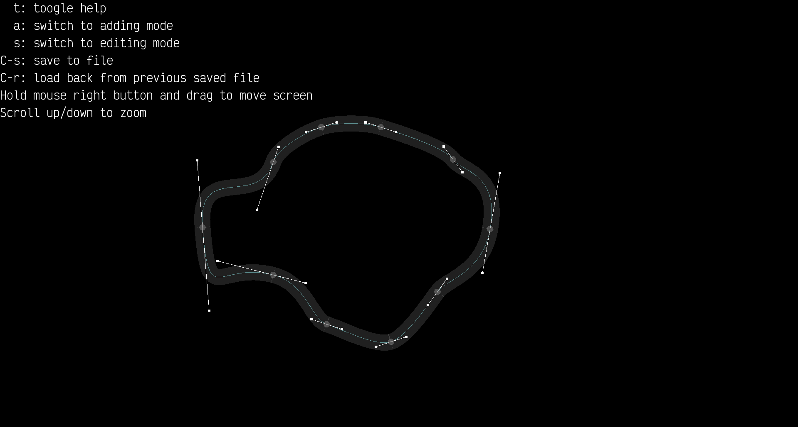

# Path-Editor
A simple path editor with sfml
Create a simple path editor for project genetic car.
Path is constructed using bezier curve.

## Demo


## Dependencies
- [SFML](https://www.sfml-dev.org/)
- [VictorMono font](https://rubjo.github.io/victor-mono/)
- [Bezier curve](https://en.wikipedia.org/wiki/B%C3%A9zier_curve)

## Quick start
```console
$ make
$ ./path_editor
```
